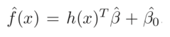

# Lesson 04 - Supervised Machine Learning - Support Vector Machines

## Summary

### Linear Classification

- We can always divide the input space into a collection of regions labelled according to the classification.
- The boundaries of these regions can be rough or smooth, depending on the prediction function.
- For an important class of procedures, these decision boundaries are linear; this is what we will mean by linear methods for classification.

"Fit linear regression models to the class indicator variables, and classify to the
largest fit. The decision boundary between two classes is that set of points for
which prediction done by the two linear models is the same." Hastie, Tibshirani, Friedman (2001)

"Model discriminant functions for each class, and then classify points to the class
with the largest value for its discriminant function." Hastie, Tibshirani, Friedman (2001)

- Any linear monotone transformation of the discriminant function will create linear
decision boundaries.
- For example, using the logit function – log[p/(1-p)] - the decision boundary is the set of points for which the log-odds are zero.
  - Methods that use logit:
    - Linear discriminant analysis (LDA)
    - Linear logistic regression

- A more direct approach is to explicitly model the boundaries between the classes as linear.
- For a two-class problem in a p-dimensional input space, this amounts to modelling the decision boundary as a hyperplane.
- Methods include:
    - Perceptron (Rosenblatt, 1958)
    - Optimal Separating Hyperplane (Vapnik, 1996)

**Linear Discriminants**
"Methods that define optimal separating hyperplanes for the case when two classes are linearly separable." Hastie, Tibshirani, Friedman (2001)

**Generalized Linear Discriminants**
"Linear functions in the augmented space map down to functions of higher order in the original space: hence linear decision boundaries expand to higher order decision boundaries." Hastie, Tibshirani, Friedman (2001)

**Augmented Dimension Maps**

**Working over projections**

**Linear discriminant analysis and logistic regression**
"Linear discriminant analysis and logistic regression both estimate linear decision boundaries in similar but slightly different ways." Hastie, Tibshirani, Friedman (2001)

**Separating Hyperplane Classifiers**
These procedures construct linear decision boundaries that explicitly try to separate the data into different classes as well as possible. Hastie, Tibshirani, Friedman (2001)

- Included in the figure (blue lines) are two of the infinitely many possible separating hyperplanes.
- The orange line is the least squares solution to the problem, which does not do a perfect job in separating the points, and makes one error.
- This is the same boundary found by LDA, in light of its equivalence with linear regression in the two-class case.

#### Perpectrons

"Classifiers such as the one resulting in the orange line, that compute a linear combination of the input features and return the sign of the response, where the line is given by { x : b0 + b1x1 + b2x2 = 0 }." Rosenblatt (1958)

**Perceptron Learning Algorithm**
"The perceptron learning algorithm tries to find a separating hyperplane by minimizing the distance of misclassified points to the decision boundary." Rosenblatt (1958)

- The goal is to minimize the error of misclassified data points, which is proportional to the distance of the misclassified points to the decision boundary.
- The algorithm in fact uses stochastic gradient descent to minimize error.
- That is, instead of computing the sum of the (error-based) gradient contributions of each observation followed by a step in the negative gradient direction, a step is taken after each observation is visited.
- Hence the misclassified observations are visited in some sequence, and the parameters are updated via a multiplicative learning rate
- **Gradient Descent**
  - If the classes are linearly separable, it can be shown that the algorithm converges to a separating hyperplane in a finite number of steps. However...
    - Problems:
      - When the data are separable, there are many solutions, and which one is found depends on the starting values.
      - The “finite” number of steps can be very large.
      - When the data are not separable, the algorithm will not converge, and cycles develop; the cycles can be long and therefore hard to detect.

#### Optimal Separating Hyperplanes

"The optimal separating hyperplane separates the two classes and maximizes the distance to the closest point from either class" Vapnik (1996)

- Provides a unique solution to the separating hyperplane problem.
- By maximizing the margin between the two classes on the training data, this leads to better classification performance on test data.

- The set of conditions of the optimization problem ensure that all the points are at least a signed distance M from the decision boundary defined by β and β0, and we seek the largest such M and associated parameters.

- Although none of the training observations fall in the margin (by construction), this will not necessarily be the case for test observations.
- The intuition is that a large margin on the training data will lead to good separation on the test data.

- The description of the solution in terms of support points seems to suggest that the optimal hyperplane focuses more on the points that count, and is more robust to model misspecification.
- The LDA solution, on the other hand, depends on all of the data, even points far away from the decision boundary. Note, however, that the identification of these support points required the use of all the data.
- Of course, if the classes are really Gaussian, then LDA is optimal, and separating hyperplanes will pay a price for focusing on the (noisier) data at the boundaries of the classes.

- When a separating hyperplane exists, logistic regression will always find it, since the log-likelihood can be driven to 0 in this case.
- When the data are not separable, there will be no feasible solution to this problem, and an alternative formulation is needed.
- Again one can enlarge the space using basis transformations, but this can lead to artificial separation through over-fitting.

**Separable and non-separable classification problems**

Suppose now that the classes overlap in feature space.
One way to deal with the overlap is to still maximize M, but allow for some points to be on the wrong side of the margin.

#### Support Vector Classifier

- The tuning parameter of this procedure is the cost parameter C.
  - Points on the wrong side of the boundary are support vectors.
  - Points on the correct side of the boundary but close to it (in the margin), are also support vectors.
  - Larger values of C focus attention more on (correctly classified) points near the decision boundary, while smaller values involve data further away.
  - Either way, misclassified points are given weight, no matter how far away

- The margin is larger for C = 0.01 (85% points are support vectors) than it is for C = 10,000 (62% of points are support vectors).
- In this example the procedure is not very sensitive to choices of C, because of the rigidity of a linear boundary.

"(A support vector machine) Produces nonlinear boundaries by constructing a linear boundary in a large, transformed version of the feature space." Vapnik (1996)

As with other linear methods, we can make the procedure more flexible by enlarging the feature space using basis expansions such as polynomials or splines.
Generally linear boundaries in the enlarged space achieve better training-class separation, and translate to nonlinear boundaries in the original space, using basis functions

the classifier function is then given by the sign of

The support vector machine classifier is an extension of this idea, where the dimension of the enlarged space is allowed to get very large, infinite in some cases.

It might seem that the computations would become prohibitive.
In fact, due to the representation of the optimization problem involving only inner products, we need not specify the transformations h(x) at all, but require only knowledge of the kernel function

that computes inner products in the transformed space.
Three popular kernels:

In each case C was tuned to approximately achieve the best test error performance, and C = 1 worked well in both cases. The radial basis kernel performs the best (close to Bayes optimal), as might be expected given the data arise from mixtures of Gaussians. The broken purple curve in the background is the Bayes decision boundary.
